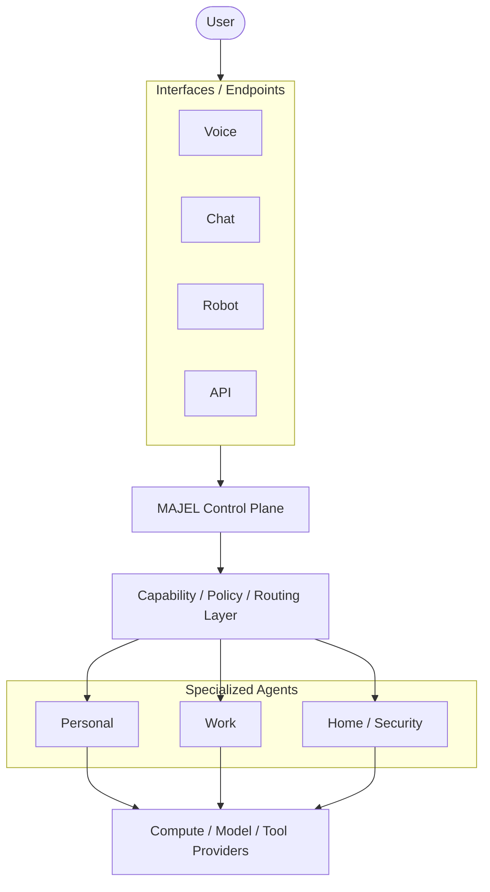

<p align="center">
  
</p>

# MAJEL

**Multi-Agent Junction & Execution Layer**

> **Status: Experimental / Early Development.** MAJEL is an evolving architecture and research project. It is not a production-ready agent platform, and most of what this README describes is intended design, not working code.

MAJEL is an open architecture for building persistent, federated AI agent systems. Instead of creating one super-agent with access to everything, MAJEL lets specialized agents work together while each keeps its own identity, credentials, permissions, and trust boundaries.

The central question behind the project:

> **How do we operate a society of AI agents without giving every agent the keys to the kingdom?**

---

## What is MAJEL?

MAJEL is a proposed **control plane** for coordinating multiple specialized AI agents. It is not an agent itself, and it is not an agent framework. It is the layer that sits between agents, the interfaces people use to reach them, and the compute that powers them.

A MAJEL control plane is intended to:

- coordinate multiple specialized AI agents
- delegate tasks between agents
- route requests based on **capabilities** rather than specific machines
- preserve credential and trust boundaries
- provide policy and authorization controls
- support heterogeneous agent runtimes and frameworks
- expose agents through multiple interfaces such as voice, chat, robots, APIs, and other endpoints
- use heterogeneous compute providers without tying agent identity to a particular machine
- provide observability and auditing around agent activity
- degrade gracefully when an agent, model, endpoint, or compute provider becomes unavailable

## Why MAJEL?

The easiest way to build a capable personal or organizational AI assistant is to give one agent access to everything: your email, your calendar, your work systems, your home, your files. That is also the riskiest way to do it.

A single omnipotent agent concentrates risk:

- **One compromise is total compromise.** A prompt injection that reaches the agent reaches every credential it holds.
- **Domains bleed together.** Personal, work, and home contexts share one memory and one set of permissions, so information leaks across boundaries that should exist.
- **Identity is fragile.** When the agent's identity and state are tied to one machine or one model server, losing that machine means losing the agent.
- **Authority is all-or-nothing.** There is no natural place to say "this agent may observe the front door camera but may not unlock the door."

MAJEL explores the alternative: a federation of specialized agents, each with narrow authority, coordinated by a control plane that routes work, enforces policy, and keeps a record of what happened.

## Architectural Principles

These principles are the current foundation of the project. They are expected to be tested, and possibly revised, through [experiments](#experiments).

1. **Agents exchange results, not credentials.**
   An orchestrating agent does not automatically inherit the credentials of the specialist agents it works with. It asks for an outcome; the specialist acts within its own authority and returns a result.

2. **Control plane ≠ compute plane.**
   Persistent agent identity and orchestration must not depend on the machine providing inference or other expensive compute.

3. **Identity should survive infrastructure.**
   An agent should be able to move between containers, machines, or compute providers without losing its identity or persistent state.

4. **Request capabilities, not machines.**
   A component asks for `speech_to_text`, not "run Whisper on DGX Spark." MAJEL decides which available provider can satisfy the capability.

5. **Trust boundaries are architectural boundaries.**
   Containers are the default deployment unit. VMs, VLANs, networks, or separate hosts are used where stronger trust isolation is required.

   > **Container** = where a workload runs.
   > **VM / network** = where a trust boundary exists.

6. **One persistent identity, many interfaces.**
   An agent may be reached through voice, chat, robots, web interfaces, mobile devices, or other endpoints without becoming a different agent on each one.

7. **Inventory before orchestration.**
   MAJEL should not grant authority over infrastructure that cannot be identified, classified, and accounted for.

8. **Authority should be progressive.**
   For systems that can affect the physical world or sensitive infrastructure, authority is granted in deliberate stages:

   1. Observe
   2. Notify
   3. Recommend
   4. Act with approval
   5. Autonomous action

9. **Agent identity and control should survive compute failure.**
   Losing an inference server or GPU should degrade capabilities, not destroy the persistent agent or the control plane.

## Conceptual Architecture

> **This diagram is conceptual.** It illustrates the intended separation of concerns. It is not a finalized implementation architecture, and none of these layers exist as working software yet.



## Capabilities and Providers

MAJEL separates **what is needed** from **who or what provides it**.

- A **capability** is a named function a component can request, such as `speech_to_text`, `text_to_speech`, or `llm_inference`.
- A **provider** is anything that can satisfy a capability: a local model server, a cloud API, a GPU host, or another agent.

Components request capabilities. The routing layer picks a provider based on availability, policy, and trust. If a provider disappears, the capability can move to another provider, or degrade, without the requesting component needing to know which machine it was talking to.

The capability vocabulary, provider contracts, and routing rules have not been defined yet. Defining them is early roadmap work.

## Agents and Trust Boundaries

In MAJEL, an agent is a persistent entity with its own:

- **identity:** who it is, independent of where it runs
- **credentials:** scoped to the minimum its role requires
- **permissions:** what it may do, and at what level of authority
- **state:** memory and context that persist across restarts and relocations
- **trust boundary:** the isolation that keeps its credentials and state away from other agents

MAJEL does not assume every agent uses the same framework. Heterogeneity is intentional. Agents built on different runtimes are expected to integrate through **adapters** and well-defined contracts. Integrations under consideration include:

- Hermes Agent
- OpenClaw
- custom agents
- local model servers
- cloud model providers
- Home Assistant
- robotic and voice endpoints

## Interfaces / Endpoints

An interface is how a person or system reaches an agent: a voice device, a chat client, a robot, a web page, a mobile app, or an API.

Interfaces are **not** agents. A single persistent agent can be reachable through many interfaces at once and remains the same agent with the same identity, memory, and permissions on each. An interface does not grant extra authority because of how the request arrived.

## Reference Implementation

MAJEL grew out of a personal experiment with the following cast:

| Component | Role |
|---|---|
| **Bailey** | Persistent chief-of-staff agent and primary user interface |
| **Herman** | Personal specialist, running on Hermes Agent |
| **Clawdia** | Work specialist, running on OpenClaw |
| **Worf** | Planned home / security specialist |
| **Reachy Mini** | Physical voice / robot endpoint |
| **DGX Spark** | AI compute provider |
| **MAJEL-CORE** | Persistent control-plane host |

**Bailey is not MAJEL.** Bailey is a personal reference implementation that runs *on top of* MAJEL. MAJEL itself is meant to stay generic, so anyone can build their own chief-of-staff agent and specialists instead of receiving Bailey.

This repository does not contain, and will not contain, Bailey's memories, credentials, personality prompts, private configuration, or other personal information. Those materials are not covered by MAJEL's [license](#license).

## Project Status

**Experimental / Early Development.**

This is a Day Zero scaffold. The repository currently contains:

- the architectural thesis and principles (this README)
- documentation structure for architecture notes, experiments, and decision records
- an empty directory layout reflecting the intended separation of concerns

It does **not** yet contain a working control plane, routing layer, policy engine, agent adapters, or deployment configuration. APIs have not been designed. Expect the structure and the principles to change as experiments produce evidence.

## Repository Structure

```text
MAJEL/
├── LICENSE                 # Apache License 2.0
├── README.md
├── compose.yaml            # Placeholder; no services defined yet
├── docs/
│   ├── assets/             # Project logo and other documentation images
│   ├── brand/              # Brand standard: name, logo, colour, and type
│   ├── architecture/       # Architecture documentation (index only for now)
│   ├── experiments/        # Experiment write-ups and template guidance
│   └── decisions/          # Architecture Decision Records (ADRs)
├── majel/                  # Future control-plane code
│   ├── core/               # Core concepts: identity, lifecycle, state
│   ├── routing/            # Capability-based request routing
│   ├── agents/             # Agent registration and description
│   ├── capabilities/       # Capability vocabulary and provider matching
│   └── policy/             # Authorization, trust, and progressive authority
├── adapters/               # Integrations with external agent runtimes and providers
│   ├── hermes/             # Hermes Agent
│   ├── openclaw/           # OpenClaw
│   ├── reachy/             # Reachy Mini voice / robot endpoint
│   └── compute/            # Compute and model providers
├── deploy/
│   └── docker/             # Container build and deployment assets
└── tests/
```

The directory descriptions record intended purpose. The `majel/` and `adapters/` directories are empty.

## Experiments

MAJEL's architectural decisions should come from experiments, not assumptions. Each significant design choice should trace back to something tried, measured, and observed.

Candidate experiments include:

- delegating a task between independently trusted agents
- surviving the loss of an AI compute provider
- moving an agent workload without losing persistent identity
- measuring cross-domain information leakage
- testing prompt-injection propagation across agent boundaries
- comparing a federated architecture with a single omnipotent agent
- routing a capability to different compute providers

**None of these experiments have been completed yet.** See [`docs/experiments/`](docs/experiments/README.md) for how experiments will be documented, and [`docs/decisions/`](docs/decisions/README.md) for how their conclusions will be recorded as Architecture Decision Records.

## Roadmap

The roadmap is intentionally loose at this stage. Early work is expected to focus on:

1. **Vocabulary.** Define agents, capabilities, providers, interfaces, and trust boundaries precisely.
2. **First experiments.** Run and document the first experiments listed above.
3. **First ADRs.** Record the decisions those experiments support.
4. **Minimal contracts.** Draft the smallest useful contracts for agent registration, capability requests, and result exchange.
5. **First adapter.** Connect one existing agent runtime through an adapter to validate the contracts.

Ordering and scope will change as the project learns.

## Security

> ⚠️ **Security guidance for anyone experimenting with MAJEL**
>
> - **Never commit credentials.** API keys, tokens, private keys, `.env` files, and agent state do not belong in this repository.
> - **Scope agent credentials to the minimum required capability.** An agent should hold only the credentials its role needs.
> - **Agents do not inherit credentials from the control plane.** The control plane coordinates; it does not hand out its own authority.
> - **Sensitive integrations need explicit trust boundaries.** Anything touching finances, identity, physical security, or the physical world should be isolated deliberately, not by convention.

## Contributing

MAJEL is at a very early stage. The most useful contributions right now are:

- discussion of the architectural principles
- proposed experiments, with a clear hypothesis
- critiques of the trust and credential model

Please open an issue to start a discussion before submitting large changes. Contribution guidelines will be formalized as the project matures.

## License

MAJEL is licensed under the [Apache License 2.0](LICENSE).

The license covers the contents of this repository only. It does **not** extend to the Bailey reference implementation's persona assets, branding, private configuration, credentials, memories, or any other material that is not part of this repository.
