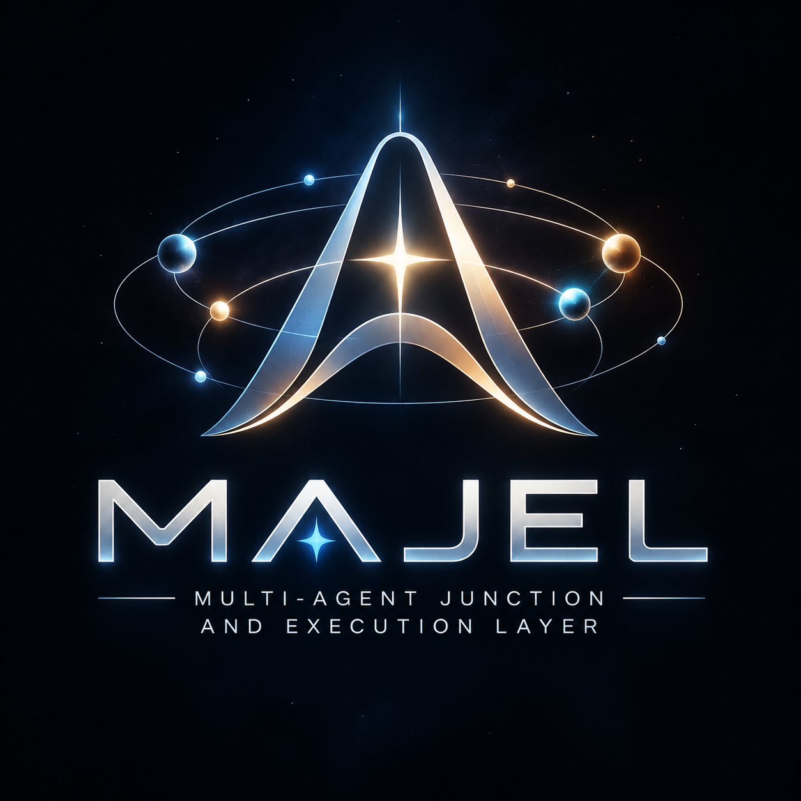
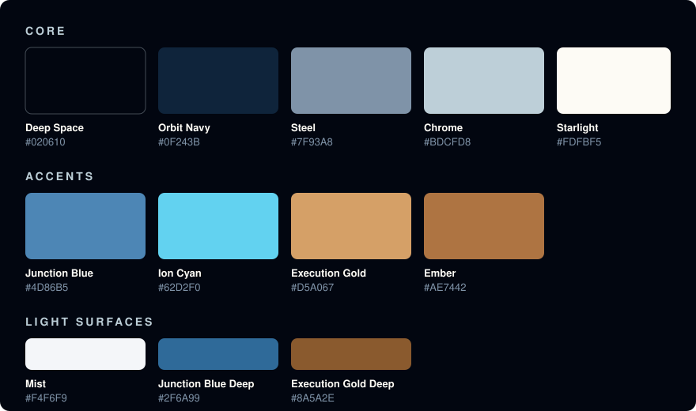

# MAJEL Brand Standard

This document defines how the MAJEL name, logo, colours, and type are used in the repository, documentation, diagrams, and any future interfaces.

> **Status: Draft (v0.1).** Like the rest of MAJEL, this standard is early. It is based on the single logo asset that exists today. Sections marked *TBD* will be filled in as more assets are produced.

<p align="center">
  
</p>

## Scope

This standard covers **MAJEL** only: the open-source project and its documentation.

It does **not** cover agents or systems built on top of MAJEL, including the Bailey reference implementation. Those systems should use their own names and visual identities. A MAJEL-based agent may say it is "built on MAJEL," but it should not present itself *as* MAJEL.

## Name

| Use | Form |
|---|---|
| Name | **MAJEL**, always in capitals |
| Full name | **Multi-Agent Junction & Execution Layer** |
| First mention in a document | MAJEL (Multi-Agent Junction & Execution Layer) |
| Code identifiers | `majel`, lowercase |

Avoid "Majel," "majel" in prose, "the MAJEL," and "MAJEL AI." In running text, use `&` in the full name; the logo spells out "AND" for typographic reasons, and both are correct.

## Logo

### Available assets

| Asset | File | Notes |
|---|---|---|
| Primary logo, full colour on dark | [`docs/assets/majel-logo.png`](../assets/majel-logo.png) | 1254 × 1254 PNG with its Deep Space background built in |

Still needed (*TBD*): a vector (SVG) master, a transparent-background version, a single-colour version for light backgrounds, a horizontal lockup, and an icon-only mark for favicons and avatars.

### Anatomy

The logo has three parts:

1. **The delta mark:** a chrome arch with a gold star at its centre, circled by orbits carrying blue and gold nodes. It represents specialised agents moving around a shared junction.
2. **The wordmark:** "MAJEL" in wide, silver-chrome capitals, with a blue star in the counter of the A.
3. **The descriptor:** "MULTI-AGENT JUNCTION AND EXECUTION LAYER," set between two thin rules.

### Usage rules

- **Background:** place the logo on Deep Space (`#020610`) or Orbit Navy (`#0F243B`). The current asset carries its own dark background, so on light pages present it as a contained square or card, not cut out.
- **Clear space:** keep a margin of at least **one quarter of the logo's width** free of text and other graphics on all sides.
- **Minimum size:** **160 px wide** on screen, or **35 mm** in print. Below that the descriptor becomes unreadable; use the icon-only mark once it exists.
- **README and docs:** display the logo centred, at **240 to 320 px** wide.

### Do not

- stretch, skew, rotate, or crop the logo
- recolour it, or apply filters, outlines, or extra glows
- place it on busy photographs or on mid-tone backgrounds
- separate the wordmark from the descriptor, or retype either one
- combine it with another project's logo to imply endorsement or partnership

## Colour

All values below were sampled from the logo file, except Steel and the three light-surface colours, which are derived from it for legibility.



### Core

| Name | Hex | RGB | Role |
|---|---|---|---|
| **Deep Space** | `#020610` | 2, 6, 16 | Primary background. The logo's field. |
| **Orbit Navy** | `#0F243B` | 15, 36, 59 | Raised surfaces, cards, panels, code blocks on dark. |
| **Steel** | `#7F93A8` | 127, 147, 168 | Muted text, captions, borders, and inactive states on dark. |
| **Chrome** | `#BDCFD8` | 189, 207, 216 | The wordmark's silver. Secondary text on dark. |
| **Starlight** | `#FDFBF5` | 253, 251, 245 | The central star. Primary text on dark. |

### Accents

The two accents carry meaning, taken from the project name:

- **Blue is the Junction:** coordination, routing, agents, capabilities, links.
- **Gold is Execution:** action, authority, the moment something is actually done.

| Name | Hex | RGB | Role |
|---|---|---|---|
| **Junction Blue** | `#4D86B5` | 77, 134, 181 | Primary accent. Coordination, routing, and primary UI elements. |
| **Ion Cyan** | `#62D2F0` | 98, 210, 240 | Highlights, links, and focus states on dark. The logo's glow. |
| **Execution Gold** | `#D5A067` | 213, 160, 103 | Secondary accent. Execution, actions, and emphasis. |
| **Ember** | `#AE7442` | 174, 116, 66 | Deep gold. Borders and fills paired with Execution Gold. |

Use gold sparingly. In the logo it marks the single point where everything converges, and it should keep that weight. As a rule of thumb, aim for roughly 70% dark base, 20% chrome and text, 8% blue, and 2% gold.

### Light surfaces

MAJEL is a dark-first identity, but GitHub, printed documents, and light-mode interfaces need a light variant.

| Name | Hex | RGB | Role |
|---|---|---|---|
| **Mist** | `#F4F6F9` | 244, 246, 249 | Light background and panels. |
| **Junction Blue Deep** | `#2F6A99` | 47, 106, 153 | Blue text, links, and accents on light backgrounds. |
| **Execution Gold Deep** | `#8A5A2E` | 138, 90, 46 | Gold text and accents on light backgrounds. |

On light backgrounds, use Orbit Navy for body text and Deep Space for headings.

### Contrast

WCAG 2.1 contrast ratios for common pairings. **AA** requires 4.5:1 for body text and 3:1 for large text (18.66 px bold or 24 px regular and above) and non-text graphics.

| Foreground | on Deep Space | on Orbit Navy | on White | on Mist |
|---|---|---|---|---|
| Starlight | 19.6 ✅ | 15.2 ✅ | ❌ | ❌ |
| Chrome | 12.6 ✅ | 9.8 ✅ | ❌ | ❌ |
| Steel | 6.4 ✅ | 5.0 ✅ | 3.2 large only | 2.9 ❌ |
| Junction Blue | 5.2 ✅ | 4.0 large only | 3.9 large only | 3.6 large only |
| Ion Cyan | 11.6 ✅ | 9.0 ✅ | ❌ | ❌ |
| Execution Gold | 8.7 ✅ | 6.8 ✅ | 2.3 ❌ | 2.1 ❌ |
| Ember | 5.2 ✅ | 4.0 large only | 3.9 large only | 3.6 large only |
| Junction Blue Deep | 3.5 large only | ❌ | 5.8 ✅ | 5.3 ✅ |
| Execution Gold Deep | 3.5 large only | ❌ | 5.9 ✅ | 5.4 ✅ |
| Orbit Navy | ❌ | — | 15.7 ✅ | 14.5 ✅ |
| Deep Space | — | ❌ | 20.3 ✅ | 18.7 ✅ |

Key rules:

- On dark backgrounds, use **Ion Cyan** rather than Junction Blue for links and small blue text.
- On light backgrounds, use the **Deep** variants for any blue or gold text.
- Never rely on colour alone to carry meaning. Pair it with a label, icon, or shape.

### Design tokens

Use these names when the palette is needed in code, stylesheets, or diagram themes:

```css
:root {
  /* Core */
  --majel-deep-space: #020610;
  --majel-orbit-navy: #0F243B;
  --majel-steel: #7F93A8;
  --majel-chrome: #BDCFD8;
  --majel-starlight: #FDFBF5;

  /* Accents */
  --majel-junction-blue: #4D86B5;
  --majel-ion-cyan: #62D2F0;
  --majel-execution-gold: #D5A067;
  --majel-ember: #AE7442;

  /* Light surfaces */
  --majel-mist: #F4F6F9;
  --majel-junction-blue-deep: #2F6A99;
  --majel-execution-gold-deep: #8A5A2E;
}
```

## Typography

The wordmark uses wide, geometric capitals. Its exact typeface is not known, so the wordmark must always be used as an image and never retyped.

For everything else, use these recommended open-licensed fonts (all SIL Open Font License, available from Google Fonts):

| Use | Typeface | Notes |
|---|---|---|
| Display | **Michroma** | Wide geometric capitals that echo the wordmark. Use only for short titles and slide headings, never for body text. |
| Headings and body | **Inter** | Clean and highly legible at every size. |
| Code, identifiers, capability names | **JetBrains Mono** | For names such as `speech_to_text`. |

In plain Markdown, where fonts can't be set, just follow the name and colour rules.

## Diagrams

Diagrams should use the palette so they read as part of the same system:

- **Background:** Deep Space or Orbit Navy on dark; white or Mist on light.
- **Nodes and lines:** Chrome or Steel for structure, Junction Blue for the control plane, routing, and agents, and Execution Gold for providers, actions, and anything that changes the world.
- **Trust boundaries:** dashed Steel outlines, so they read as boundaries rather than components.

For Mermaid diagrams, this theme block applies the palette:

```text
%%{init: {"theme": "base", "themeVariables": {
  "background": "#020610",
  "primaryColor": "#0F243B",
  "primaryTextColor": "#FDFBF5",
  "primaryBorderColor": "#4D86B5",
  "secondaryColor": "#0F243B",
  "tertiaryColor": "#020610",
  "lineColor": "#7F93A8",
  "clusterBkg": "#0F243B",
  "clusterBorder": "#7F93A8",
  "fontFamily": "Inter, Segoe UI, Helvetica, Arial, sans-serif"
}}}%%
```

Test Mermaid diagrams in both GitHub light and dark mode before committing. A dark-themed diagram can look heavy on a light page.

## Voice

Written material about MAJEL should read like the project: precise, calm, and honest about its maturity.

- Say what exists, and label what is proposed.
- Prefer plain words over hype. Avoid "revolutionary," "autonomous AI workforce," and similar claims.
- Describe agents as systems, not people. The Bailey reference implementation has a persona; MAJEL does not.

## Trademarks and licensing

The [Apache License 2.0](../../LICENSE) covers MAJEL's code and documentation. Section 6 of that license explicitly does **not** grant permission to use the project's trade names, trademarks, or product names. Using the MAJEL name and logo to refer to this project is welcome; using them in a way that suggests endorsement, or as the name of a different product, is not.

## Changes to this standard

Propose changes through a pull request. Changes to the palette or logo should include before-and-after examples and, for colours, updated contrast figures.
